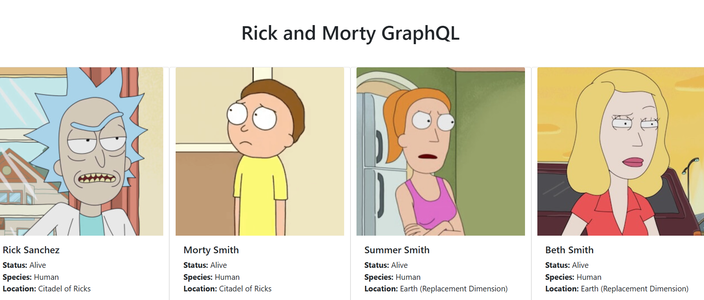

### Rick and Morty GraphQL

This is an exercise project that connects with Rick and Morty API using GraphQL.

The project is a small, clean example of consuming a public API with GraphQL and presenting the data in a simple user interface for portfolio use.



---

### Stack

- React
- GraphQL
- Apollo Client
- Create React App

---

### Installation

Install the dependencies:

```bash
npm install
```

Start the development server:

```bash
npm start
```

Then open http://localhost:3000 in your browser.
